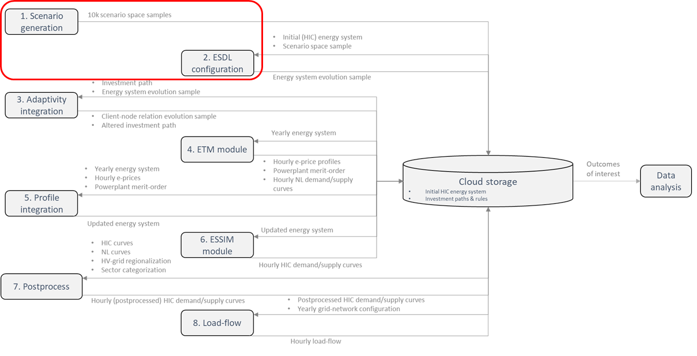

# Gridmaster-scenario-generation

## Description

This repository contains the 'Scenario generation' and 'ESDL configuration' module that composes the scenario -space & -pathways (i.e. space samples) and corresponding ESDLs (i.e. energy system evolution sample) respectively as shown in the schematic overview below (for a more elaborate description of the figure refer to the 'gridmaster-event-chain' repository). This repository contains all the Python scripts and data required for execution of the module. Due to confidentiality, some data was removed. Therefore, this repository will not run out of the box.

The 'Scenario generation' module computes different combinations of uncertainty values that result in scenario space based with help of the LHS algortihm present in the [EMA workbench](https://github.com/quaquel/EMAworkbench). A combination describes the scenario events over the specific reference years. Subsequently, each combination is used to generate the ESDLs for each reference year based upon the initial (HIC) energy system in the 'ESDL configuration' module. All data is stored by creating the required subfolders as shown below:

    .
    ├── scenarioID
        ├── scenario_json.json
        └── scenarioYear
            └── base.esdl

## Required input

DISCLAIMER: All confidential data has been removed from the data files. These files only contain data based upon public available information and/or educated assumptions.

- **hic_description_final.xlsx:** This file contains the description of the initial energy system and investment paths.
- **grismaster_profiles_new.csv":** This file contains the hourly supply/demand curves of energy system assets.
- **2021_hic_description.esdl:** This file contains the initial (HIC) energy system in ESDL format.

### Files to construct the ESDLs

Based upon the uncertainty value combinations (i.e. scenario space samples), presented files are used to alter and complement combinations to compute the scenaro space and construct the ESDLs in the 'Scenario generation' and 'ESDL configuration' module repectively.

- **H2_export_table.xlsx**
- **area_MV.xlsx**
- **area_table.xlsx**
- **biogasolefin_table.xlsx**
- **boilerpathways_table.xlsx**
- **com_price_factors.xlsx**
- **com_prices.xlsx**
- **comprices.xlsx**
- **factor_table.xlsx**
- **furnace_pathways_table.xlsx**
- **naptha_table.xlsx**
- **offshore_table.xlsx**
- **onshore_PV_table.xlsx**
- **onshore_wind_table.xlsx**
- **plasticolefin1_table.xlsx**
- **plasticolefin2_table.xlsx**
- **scenario_factor0.xlsx**
- **scenario_factor16a.xlsx**
- **shorepower_table.xlsx**
- **synfuel1_table.xlsx**
- **synfuel2_table.xlsx**
- **synfuel3_table.xlsx**
- **synmeoh1_table.xlsx**
- **synmeoh2_table.xlsx**
- **synmeoh3_table.xlsx**

For a more elaborate description of the method and detailed narratives on the module refer to the Gridmaster report that can be found on the [Gridmaster website](https://gridmaster.nl/).

## Other Gridmaster tooling

The public results of the multi-model simulations are published with Tableau and can be accessed through the following link: [Access visualization tool](https://public.tableau.com/app/profile/gridmaster2022)
